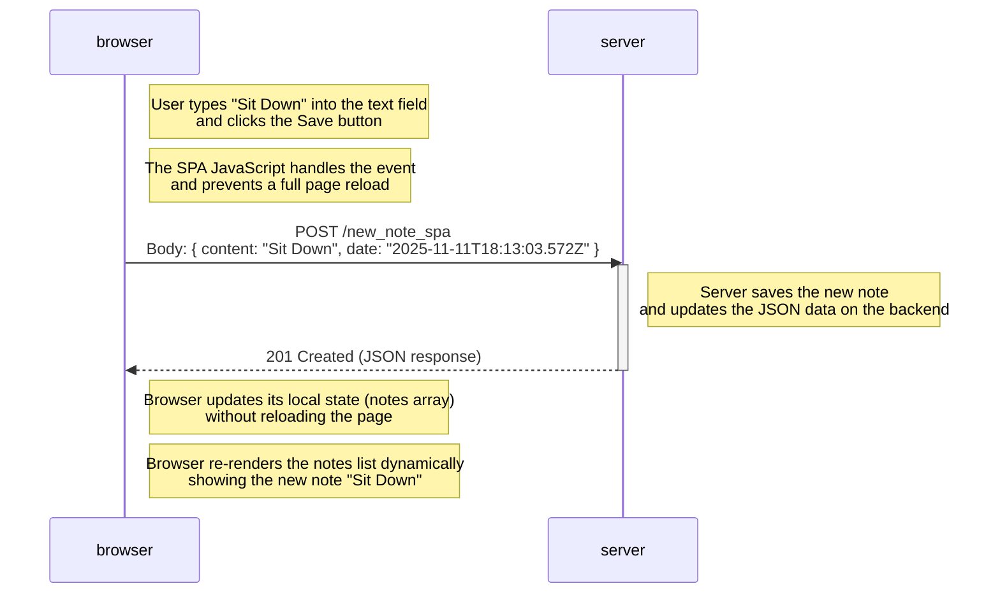

```mermaid
sequenceDiagram
    participant browser
    participant server

    Note right of browser: User types "Sit Down" into the text field<br/>and clicks the Save button

    Note right of browser: The SPA JavaScript handles the event<br/>and prevents a full page reload

    browser->>server: POST /new_note_spa<br/>Body: { content: "Sit Down", date: "2025-11-11T18:13:03.572Z" }
    activate server
    Note right of server: Server saves the new note<br/>and updates the JSON data on the backend
    server-->>browser: 201 Created (JSON response)
    deactivate server

    Note right of browser: Browser updates its local state (notes array)<br/>without reloading the page

    Note right of browser: Browser re-renders the notes list dynamically<br/>showing the new note "Sit Down"
```